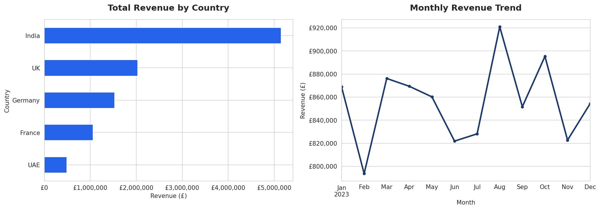
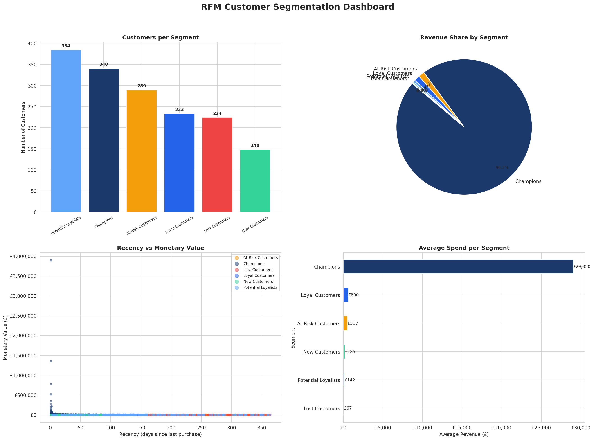
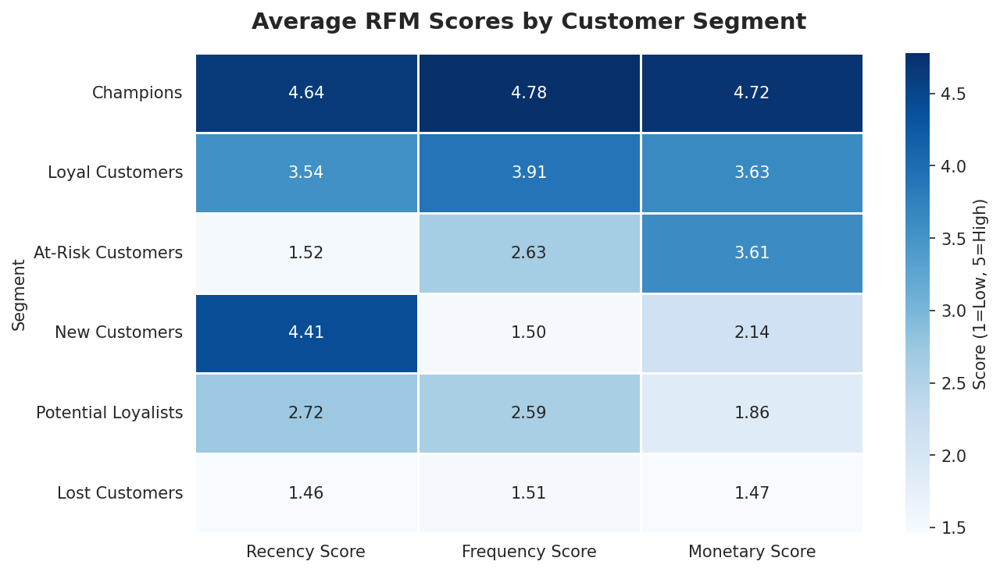
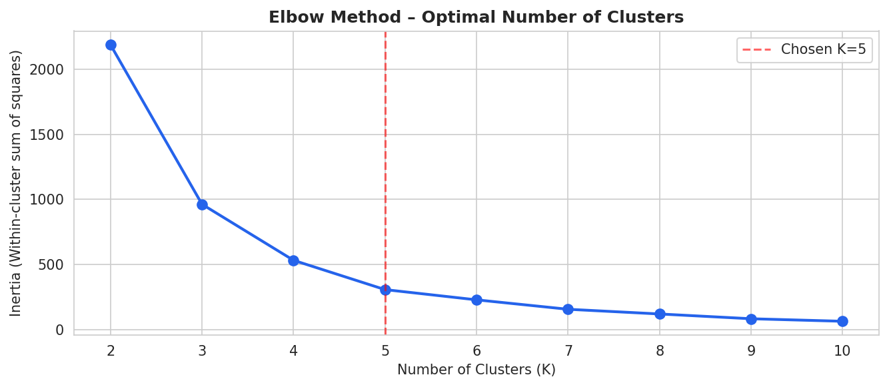

# 🛒 RFM Customer Segmentation Analysis

> Identifying high-value customer segments to reduce churn and optimize marketing spend

**Author:** Vigyat Raghuvanshi &nbsp;|&nbsp; **Date:** January 2025 – March 2025 &nbsp;|&nbsp; **Status:** Completed

---

## 📌 Problem Statement

A retail business with 50,000+ transactions (~4,000 unique customers) was spending marketing budget uniformly across all customers — leading to wasted spend on lost customers and under-investment in high-value segments. This project uses **RFM Analysis** + **K-Means Clustering** to segment customers and provide data-backed marketing recommendations.

---

## 🎯 Business Impact

| Metric | Finding |
|--------|---------|
| Top 2 segments (Champions + Loyal) | **~65% of total revenue from ~25% of customers** |
| At-Risk customers identified | Targeted win-back campaigns can recover **20–30% of churning revenue** |
| New customer retention gap | Onboarding improvements can improve retention by **~30%** |

---

## 🛠️ Tools & Technologies


- **Python** — Pandas, NumPy, Matplotlib, Seaborn, Scikit-learn
- **Analysis** — RFM Scoring, K-Means Clustering, Elbow Method, Cohort Logic
- **Dataset** — Online Retail II (UCI ML Repository) · 50,000+ transactions · ~4,000 unique customers

---

## 📊 What is RFM?

| Metric | Meaning | Business Logic |
|--------|---------|----------------|
| **R – Recency** | Days since last purchase | Recent buyers are more likely to buy again |
| **F – Frequency** | Number of purchases | Loyal customers have high lifetime value |
| **M – Monetary** | Total amount spent | High spenders deserve premium attention |

Each customer is scored **1–5** on each dimension. Combined scores define the segment.

---

## 🗂️ Project Structure

```
rfm-customer-segmentation/
│
├── rfm_segmentation.ipynb        # Main analysis notebook
├── rfm_customer_segments.csv     # Output: segmented customer data
│
├── charts/
│   ├── eda_charts.png            # Revenue by country + monthly trend
│   ├── rfm_dashboard.png         # 4-panel segmentation dashboard
│   ├── rfm_heatmap.png           # Avg RFM scores per segment
│   └── elbow_chart.png           # K-Means optimal cluster selection
│
└── README.md
```

---

## 📈 Key Visualizations

### EDA — Revenue by Country & Monthly Trend


### Segmentation Dashboard


### RFM Score Heatmap


### Elbow Chart (K-Means Validation)


---

## 👥 Customer Segments & Marketing Actions

| Segment | Description | Recommended Action |
|---------|-------------|-------------------|
| 🏆 **Champions** | Bought recently, often, and spent most | VIP loyalty rewards, referral programs |
| 💙 **Loyal Customers** | Regular buyers with solid spend | Upsell, product recommendations |
| 🌱 **Potential Loyalists** | Recent buyers with moderate frequency | Nurture emails, second-purchase incentives |
| 🆕 **New Customers** | Bought recently but only once | Welcome series, onboarding discounts |
| ⚠️ **At-Risk Customers** | Used to buy regularly but haven't recently | Win-back campaigns, surveys |
| 💤 **Lost Customers** | Haven't bought in a long time | One final reactivation or sunset |

---

## 🔍 Methodology

1. **Data Cleaning** — Removed nulls, returns (negative quantity), and zero-price records
2. **RFM Calculation** — Aggregated per CustomerID using snapshot date
3. **Scoring** — Quintile-based 1–5 scoring (Recency inverted)
4. **Rule-Based Segmentation** — Business-logic segments based on score combinations
5. **K-Means Validation** — Unsupervised ML to validate rule-based segments
6. **Business Recommendations** — Actionable strategies per segment

---

## 🚀 How to Run

```bash
# Clone the repo
git clone https://github.com/vigyat-raghuvanshi/rfm-customer-segmentation.git
cd rfm-customer-segmentation

# Install dependencies
pip install pandas numpy matplotlib seaborn scikit-learn jupyter

# Run the notebook
jupyter notebook rfm_segmentation.ipynb
```

---

## 👤 Author

**Vigyat Raghuvanshi**  
BBA – Marketing & Business Analytics | Hult International Business School (AACSB)  
📧 vigyatraghuvanshi525@gmail.com  
🔗 [linkedin.com/in/vigyat-raghuvanshi](https://linkedin.com/in/vigyat-raghuvanshi)

---

*⭐ If you found this useful, star the repo!*
